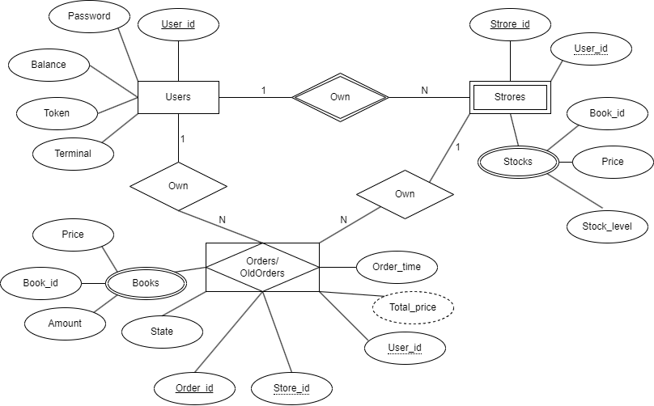
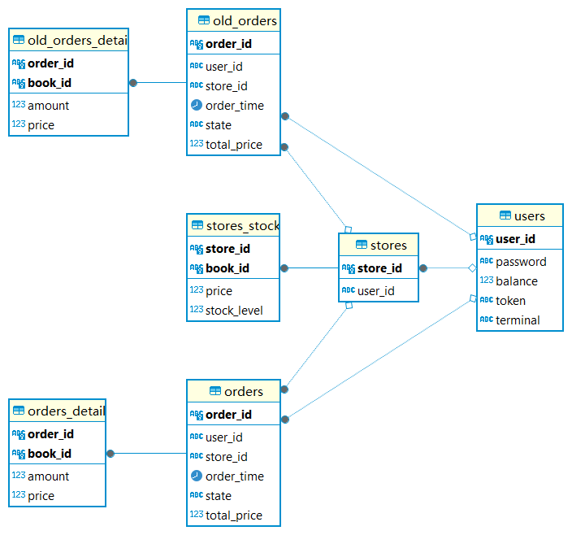
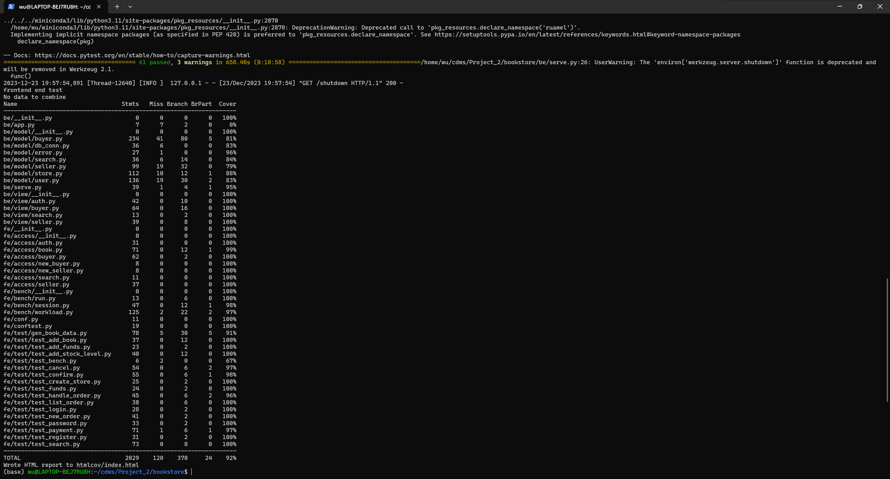
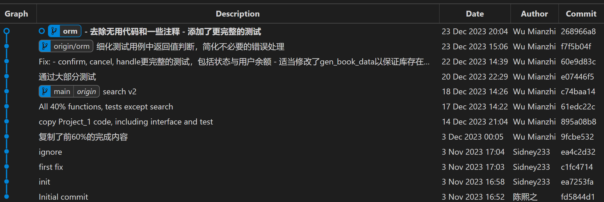

# Bookstore项目报告

10215501411 吴冕志

## 1. 文件结构：

```bash
│  app.log
│  be.db
│  info.txt
│  requirements.txt
│  setup.py
│  
│              
├─be
│  │  app.py
│  │  serve.py
│  │  __init__.py
│  │  
│  ├─model
│  │  │  buyer.py
│  │  │  db_conn.py
│  │  │  error.py
│  │  │  search.py
│  │  │  seller.py
│  │  │  store.py
│  │  │  user.py
│  │  │  __init__.py  
│  │          
│  ├─view
│  │  │  auth.py
│  │  │  buyer.py
│  │  │  search.py
│  │  │  seller.py
│  │  │  __init__.py
│          
├─doc
│      auth.md
│      buyer.md
│      search.md
│      seller.md
│      
├─fe
│  │  conf.py
│  │  conftest.py
│  │  __init__.py
│  │  
│  ├─access
│  │  │  auth.py
│  │  │  book.py
│  │  │  buyer.py
│  │  │  new_buyer.py
│  │  │  new_seller.py
│  │  │  search.py
│  │  │  seller.py
│  │  │  __init__.py
│  │          
│  ├─bench
│  │  │  bench.md
│  │  │  run.py
│  │  │  session.py
│  │  │  workload.py
│  │  │  __init__.py
│  ├─data
│  │      book.db
│  │      scraper.py
│  │      
│  ├─test
│  │  │  delete_collections.py
│  │  │  gen_book_data.py
│  │  │  test.md
│  │  │  test_add_book.py
│  │  │  test_add_funds.py
│  │  │  test_add_stock_level.py
│  │  │  test_bench.py
│  │  │  test_cancel.py
│  │  │  test_confirm.py
│  │  │  test_create_store.py
│  │  │  test_funds.py
│  │  │  test_handle_order.py
│  │  │  test_list_order.py
│  │  │  test_login.py
│  │  │  test_new_order.py
│  │  │  test_password.py
│  │  │  test_payment.py
│  │  │  test_register.py
│  │  │  test_search.py
│      
└─script
        test.sh
```

## 2. 数据库设计：

### 2.1 schema设计

参考实验要求，我分别采用关系型数据库(PostgreSQL)与文档型数据库(MongoDB)来存储核心数据与blob数据。

对于存储核心数据的关系型数据库，我首先基于功能设计与要求绘制了下面的ER图，用于辅助我具体设计数据库的表结构



基于上面的ER图草稿，我设计的数据库具体有下面的结构：

- 为所有实体/弱实体/关联实体和多值属性设置独立的表
- 所有实体间的关系都是1对多的，因此不需要添加额外的表，只需要在N的一方添加属性即可
- 为old_orders, old_orders_details设置单独的表，用于存储已完成的订单数据与订单详情数据




### 2.2 冗余与规范化

考察我们数据库的设计：

- 数据库的设计中不存在组合属性，符合**1NF**
- 所有表的列都完全依赖整个主键，而非部分主键，符合**2NF**
- 所有表中的列都不存在传递依赖，符合**3NF**
- orders表中存在order_id对(user_id, store_id)的依赖，不符合**BCNF**

一般来说，满足**3NF**对于数据库设计来说就足够了，可以保证数据库中不存在较大的冗余；同时，如果按照规范化方式对表进行分拆，会降低我们执行数据库操作的效率，例如，如果我们对orders表进行分拆，那么我们在获取订单的完整信息时，要么对两张表进行连接操作，要么进行多次数据库查询，两种解决方案都会降低执行效率。

在大部分应用场景下，增加存储空间是容易实现的，而操作的响应时间是我们更关注的指标，因此我们允许冗余的存在。

上面的数据库设计中唯一存在的冗余项就是orders/old_orders中的total_price列，该列的值事实上可以通过对应的详情表中对应order_id的所有amount * price的求和得到。该冗余可以帮助我们减少orders表与orders_details表的连接，筛选与聚合计算操作，从而提升执行效率。

冗余的一个问题就是会带来保持数据一致性的繁琐操作，但是上面设计中的total_price列只需要在新建订单时计算一次即可，之后始终作为只读属性被访问，不会引入额外的保证一致性的操作。

### 2.3 文档数据库到关系型数据库的变化

由于我们Project 1的设计[]本身就接近关系型数据库的设计，因此结构上的明显变化并不多，为了满足关系型数据库的要求，与之前的设计相比：

- store本身的数据被从users表中分拆出来。这是因为当一个用户可以拥有多个书店时，原先users表中表示对应属性的部分就成为了多值属性，对于文档型数据库，我们可以用列表来存储，但对于关系型数据库，这样的设计不符合**1NF**，同样也无法基于它来进行CRUD操作，因此我们需要将该属性分离到单独的表上。
- orders与old_orders_details（Orders与OrdersArchive）的订单详情被分别存放在两张表中。这是为了满足外键约束的要求，在我们的设计中，订单详情中的order_id应当是指向所在orders表中的外键，在关系型数据库中，我们必须为两个存放order的表设计单独的详情表，以保证外键约束的成立。

## 3.功能，接口，与测试的实现细节：

### 3.1 基本模式

在实现后端功能时，对于数据库的操作我都使用了SQLAlchemy提供的Session机制来实现可靠的事务控制与处理，一般来说，访问数据库的后端操作具有下面的模板

```
### 一些其它操作，例如验证参数有效性
Session = sessionmaker(bind=self.engine)
session = Session()

# 对映射的对象进行数据库操作，例如
buyer = session.query(store.User).filter_by(user_id=user_id).first()
buyer.balance = buyer.balance + 1
# 提交事务，在session被commit前，任何对于数据库的修改都只是在（程序）本地进行的，没有被持久化到数据库中
session.commit()
# 关闭session
session.close()

### 其它的异常处理操作
```

上面的模式保证了在操作出现异常时不会产生不完整或错误的修改，保证了操作的原子性。

### 3.2 关系型数据库带来的实现简化

与NoSQL数据库相比，关系型数据库由于存在严格的关系约束，可以保证表中的各个属性，或者不同表的属性之间存在严格的关系，从而帮助应用程序在实现功能时简化操作，例如

- 关系型数据库允许进行高效的表的连接操作，这简化了应用程序进行多表查询的流程。
- 我们可以在关系型数据库中为表中的某些列添加约束，这样在数据插入或更改时数据库会自动替我们检查数据的合法性，减少我们的负担。例如，我们在`orders`表中为`user_id, store_id`添加了外键约束，这样就可以保证我们从表中获取的id一定是合法的，在从`users, stores`表中查询或更改就不再需要判断id对应的记录是否存在。在接下来的实现中，我多次使用了这一约束来简化功能的实现。

### 3.3 数据库的连接，创建，与基本操作

#### store.py

`store.py`中的主要功能包括：

1. 建立到PostgreSQL与MongoDB的数据库连接：`store.StoreServer::__init__()`方法
2. 建立表到对象的映射关系：`store.User, stote.Store, store.StoreStock, store.Order, store.OrderDetail, store.OldOrder, store.OldOrderDetail`类
3. 创建关系型数据库中的各个表与MongoDB中的collection（如果需要）：`store.StoreServer::init_tables()`方法

 对于每个表映射到的对象，我们只需要按照对应的列名以及约束为类提供属性即可，例如：

```
class Order(Base):
    __tablename__ = 'orders'
    order_id = Column(String, primary_key=True)
    user_id = Column(String, ForeignKey('users.user_id'))
    store_id = Column(String, ForeignKey('stores.store_id'))
    order_time = Column(TIMESTAMP)
    state = Column(String)
    total_price = Column(Integer)
    user = relationship('User')
    store = relationship('Store')
```

#### db_conn.py

`db_conn.py`主要为其它的后端`model`提供了基类，并提供了一些必要的工具方法：

1. 检查`user_id`是否存在：`user_id_exist`方法
2. 检查`store_id`是否存在：`store_id_exist`方法
3. 检查`book_id`是否存在：`book_id_exist`方法
4. 检查`order_id`是否存在:`order_id_exist`方法

这些方法的实现都很类似，以`book_id_exist`方法为例，我们使用SQLAlchemy提供的exists()查询来判断是否存在指定id的记录

```
    def book_id_exist(self, store_id, book_id):
        Session = sessionmaker(bind=self.engine)
        session = Session()
        condition = exists().where(store.StoreStock.store_id == store_id, store.StoreStock.book_id == book_id)
        res = session.query(condition).scalar() != 0
        session.close()
        return res
```

### 3.4 用户相关功能，接口，与测试用例

#### 用户注册与注销

- URL: `/auth/register,/auth/unregister `
- 后端实现：`be/model/user.py/User::register(), be/model/user.py/User::unregister()`
- 测试用例：`fe/test/test_register.py`

| code | register 状态 | unregister 状态 | 测试函数                             |
| ---- | ------------- | --------------- | ------------------------------------ |
| 200  | ok            | ok              | test_register_ok, test_unregister_ok |
| 401  | \             | 密码错误        | test_unregister_error_authorization  |
| 511  | \             | user_id不存在   | test_unregister_error_authorization  |
| 512  | user_id重复   | \               | test_register_error_exist_user_id    |
| 528  | \             | 其它数据库错误  | \                                    |
| 530  | \             | 其它Python错误  | \                                    |

`register()`方法接受`user_id, password`作为参数，向`users`表中插入一条新的记录。由于`user_id`是主键，重复插入时数据库会提示错误，此时返回`512: "exist user id {}"`

`unregister()`方法接受`user_id, password`作为参数，首先验证密码，随后在表中删除对应id的记录

#### 用户登录与登出

- URL: `/auth/login,/auth/logout `
- 后端实现：`be/model/user.py/User::login(), be/model/user.py/User::logout ()`
- 测试用例：`fe/test/test_login.py`

| code | login状态      | logout 状态    | 测试函数                     |
| ---- | -------------- | -------------- | ---------------------------- |
| 200  | ok             | ok             | test_ok                      |
| 401  | 密码错误       | token错误      | test_error_password, test_ok |
| 511  | user_id不存在  | user_id不存在  | test_error_user_id, test_ok  |
| 528  | 其它数据库错误 | 其它数据库错误 | \                            |
| 530  | 其它Python错误 | 其它Python错误 | \                            |

`login()`方法接受`user_id, password, terminal`作为参数，验证密码正确，生成新的token，向`users`表修改对应记录。

`logout ()`方法接受`user_id, token`作为参数，首先验证token，随后生成新的dummy_token，在`users`表中修改记录

#### 修改密码

- URL: `/auth/password`
- 后端实现：`be/model/user.py/User::change_password`
- 测试用例：`fe/test/test_password.py`

| code | password状态   | 测试函数            |
| ---- | -------------- | ------------------- |
| 200  | ok             | test_ok             |
| 401  | 密码错误       | test_error_password |
| 511  | user_id不存在  | test_error_user_id  |
| 528  | 其它数据库错误 | \                   |
| 530  | 其它Python错误 | \                   |

`change_password()`方法接受`user_id, old_password, new_password`作为参数，首先验证密码正确，随后在`users`表中修改对应记录。

### 3.5 卖家相关功能，接口与测试用例

#### 创建商店

- URL: `/seller/create_store`
- 后端实现：`be/model/seller.py/Seller::create_store`
- 测试用例：`fe/test/test_create_store.py`

| code | create_store状态 | 测试函数                  |
| ---- | ---------------- | ------------------------- |
| 200  | ok               | test_ok                   |
| 511  | user_id不存在    | test_error_user_id        |
| 514  | store_id重复     | test_error_exist_store_id |
| 528  | 其它数据库错误   | \                         |
| 530  | 其它Python错误   | \                         |

`create_store()`方法接受`user_id, store_id`作为参数，首先验证user_id存在，store_id不存在，随后在stores表中插入新的记录

#### 上架书本

- URL: `/seller/add_book`
- 后端实现：`be/model/seller.py/Seller::add_book`
- 测试用例：`fe/test/test_add_book.py`

| code | add_book状态        | 测试函数                      |
| ---- | ------------------- | ----------------------------- |
| 200  | ok                  | test_ok                       |
| 511  | user_id不存在       | test_error_non_exist_user_id  |
| 513  | store_id不存在      | test_error_non_exist_store_id |
| 516  | book_id在商店中重复 | test_error_exist_book_id      |
| 528  | 其它数据库错误      | \                             |
| 530  | 其它Python错误      | \                             |

`add_book()`方法接受`user_id, store_id, book_id, book_json_str, stock_level`作为参数：

1. 首先验证user_id存在，store_id存在。
2. 对书本的blob数据中content等文本内容进行中文分词，从书本信息中读取定价
3. 向stores_stocks表插入库存记录，
4. 向MongoDB的对应collection中插入书本的blob信息与store_id。

#### 添加商品库存

- URL: `/seller/add_stock_level`
- 后端实现：`be/model/seller.py/Seller::add_stock_level`
- 测试用例：`fe/test/test_add_stock_level.py`

| code | add_stock_level状态 | 测试函数            |
| ---- | ------------------- | ------------------- |
| 200  | ok                  | test_ok             |
| 511  | user_id不存在       | test_error_user_id  |
| 513  | store_id不存在      | test_error_store_id |
| 516  | book_id不存在       | test_error_book_id  |
| 528  | 其它数据库错误      | \                   |
| 530  | 其它Python错误      | \                   |

`add_stock_level()`方法接受`user_id, store_id, book_id, add_stock_level`作为参数：

1. 首先验证user_id存在，store_id, book_id存在。
2. 在stores_stocks表更新库存记录，

#### 卖家发货

- URL: `/seller/handle_order`
- 后端实现：`be/model/seller.py/Seller::handle_order`
- 测试用例：`fe/test/test_handle_order.py`

| code | handle_order状态 | 测试函数                |
| ---- | ---------------- | ----------------------- |
| 200  | ok               | test_ok_and_error_state |
| 511  | user_id不存在    | test_error_user_id      |
| 513  | store_id不存在   | test_error_store_id     |
| 518  | order_id不存在   | test_error_order_id     |
| 520  | 订单状态错误     | test_ok_and_error_state |
| 528  | 其它数据库错误   | \                       |
| 530  | 其它Python错误   | \                       |

`handle_order()`方法接受`user_id, store_id, order_id`作为参数：

1. 首先验证user_id存在，store_id,  order_id存在。
2. 从orders表中获取订单，并确认订单状态为待发货("ToShip")
3. 在orders表中修改订单状态为已发货"Shipped"

测试用例的实现：

- 在运行前注册卖家与买家，为买家充值足够多的余额，买家发起订单并付款
- `test_error_xxx_id`：修改参数中的xxx_id项，检查返回值
- `test_ok_and_error_state`：检查正确参数的返回值，调用买家的`list_orders`方法检查所有订单，确保对应order_id的订单存在，并且状态正确（正确性测试）
- `test_ok_and_error_state`：在handle过订单的基础上，再次传递相同参数，检查返回值是否为520（订单状态错误）

### 3.6 买家相关功能，接口与测试用例

#### 创建订单

- URL: `/buyer/new_order`
- 后端实现：`be/model/buyer.py/Buyer::new_order`
- 测试用例：`fe/test/test_new_order.py`

| code | new_order状态  | 测试函数                |
| ---- | -------------- | ----------------------- |
| 200  | ok             | test_ok                 |
| 511  | user_id不存在  | test_non_exist_user_id  |
| 513  | store_id不存在 | test_non_exist_store_id |
| 515  | book_id不存在  | test_non_exist_book_id  |
| 517  | 库存不足       | test_low_stock_level    |
| 528  | 其它数据库错误 | \                       |
| 530  | 其它Python错误 | \                       |

`new_order()`方法接受`user_id, store_id, id_and_count`作为参数：

1. 首先验证user_id存在，store_id存在。
2. 生成唯一的order_id，向orders表中插入新记录，初始化订单总价为0
3. 从id_and_count列表中获取订单详细信息，向order_details表中插入记录，计算累计价格
4. 在orders表中修改订单总总价为计算后的累计价格

#### 买家付款

- URL: `/buyer/payment`
- 后端实现：`be/model/buyer.py/Buyer::payment`
- 测试用例：`fe/test/test_payment.py`

| code | payment状态    | 测试函数                |
| ---- | -------------- | ----------------------- |
| 200  | ok             | test_ok                 |
| 401  | 密码错误       | test_error_password     |
| 511  | user_id不存在  | test_non_exist_user_id  |
| 518  | order_id不存在 | test_non_exist_order_id |
| 519  | 余额不足       | test_not_suff_funds     |
| 520  | 订单状态错误   | test_repeat_pay         |
| 528  | 其它数据库错误 | \                       |
| 530  | 其它Python错误 | \                       |

`payment()`方法接受`user_id, password, order_id`作为参数：

1. 首先验证user_id存在，order_id存在。
2. 从orders表中获取订单，并确认订单状态为待付款("Pending")
3. 验证买家密码正确
4. 验证买家余额充足
5. 在users表中修改记录，为买家扣除余额，为卖家添加余额

与提供的代码相比，我增加了两个测试：

- test_non_exist_order_id 检查错误order_id下能够正确返回错误代码
- test_non_exist_user_id检查错误user_id下能够正确返回错误代码

#### 买家充值

- URL: `/buyer/add_funds`
- 后端实现：`be/model/buyer.py/Buyer::add_funds`
- 测试用例：`fe/test/test_add_funds.py`

| code | add_funds状态  | 测试函数            |
| ---- | -------------- | ------------------- |
| 200  | ok             | test_ok             |
| 401  | 密码错误       | test_error_password |
| 511  | user_id不存在  | test_error_user_id  |
| 528  | 其它数据库错误 | \                   |
| 530  | 其它Python错误 | \                   |

`add_funds()`方法接受`user_id, password, add_value`作为参数：

1. 首先验证user_id存在
2. 验证买家密码正确
3. 在users表中修改记录，为买家添加余额`add_value`

#### 买家查询余额

- URL: `/buyer/funds`
- 后端实现：`be/model/buyer.py/Buyer::funds`
- 测试用例：`fe/test/test_funds.py`

| code | funds状态      | 测试函数            |
| ---- | -------------- | ------------------- |
| 200  | ok             | test_ok             |
| 401  | 密码错误       | test_error_password |
| 511  | user_id不存在  | test_error_user_id  |
| 528  | 其它数据库错误 | \                   |
| 530  | 其它Python错误 | \                   |

`funds()`方法接受`user_id, password`作为参数，返回(code, message, funds)：

1. 首先验证user_id存在
2. 验证买家密码正确
3. 在users表中查询买家余额并返回

测试用例包含下面的操作：

- 初始化买家，为其充值指定金额（1000）
- `test_ok`：检查状态码与返回的查询余额是否为1000
- `test_error_user_id`：提供错误参数，检查返回状态码
- `test_error_password`：提供错误参数，检查返回状态码

#### 买家确认订单

- URL: `/buyer/confirm`
- 后端实现：`be/model/buyer.py/Buyer::confirm`
- 测试用例：`fe/test/test_confirm.py`

| code | confirm状态    | 测试函数               |
| ---- | -------------- | ---------------------- |
| 200  | ok             | test_ok                |
| 401  | 密码错误       | test_error_password    |
| 511  | user_id不存在  | test_error_user_id     |
| 518  | order_id不存在 | test_error_order_id    |
| 520  | 订单状态错误   | test_error_order_state |
| 528  | 其它数据库错误 | \                      |
| 530  | 其它Python错误 | \                      |

`confirm()`方法接受`user_id, password, order_id`作为参数：

1. 首先验证user_id, order_id存在
2. 验证订单状态正确，为已发货"Shipped"
3. 验证买家密码正确
4. 移动订单和它的详细信息到old_orders和old_orders_details表中，修改订单状态为已收货"Received"

测试用例的实现：

- 在运行前注册卖家与买家，为买家充值足够多的余额，买家发起两个订单并付款，卖家对其中一个订单发货。
- `test_error_xxx_id/password`：修改参数中的xxx_id/password项，检查返回值
- `test_ok`：检查正确参数的返回值，调用买家的`list_orders`方法检查所有订单，确保对应order_id的订单存在，并且状态正确
- `test_error_order_state`：将预先发起的未发货订单id作为参数调用方法，检查此时返回的状态码

#### 买家取消订单

- URL: `/buyer/cancel`
- 后端实现：`be/model/buyer.py/Buyer::cancel`
- 测试用例：`fe/test/test_cancel.py`

| code | cancel状态     | 测试函数              |
| ---- | -------------- | --------------------- |
| 200  | ok             | test_ok_and_err_state |
| 401  | 密码错误       | test_error_password   |
| 511  | user_id不存在  | test_error_user_id    |
| 518  | order_id不存在 | test_error_order_id   |
| 520  | 订单状态错误   | test_ok_and_err_state |
| 528  | 其它数据库错误 | \                     |
| 530  | 其它Python错误 | \                     |

`cancel()`方法接受`user_id, password, order_id`作为参数：

1. 首先验证user_id, order_id存在
2. 验证订单状态正确，不能为已收货或已取消
3. 验证买家密码正确
4. 如果买家已经付款，那么重新为买家添加余额，为卖家扣除订单总价，为卖家库存重新添加书本
5. 移动订单和它的详细信息到old_orders和old_orders_details表中，修改订单状态为已取消"Cancelled"

测试用例的实现：

- 在运行前注册卖家与买家，为买家充值足够多的余额，买家发起订单并付款。
- `test_error_xxx_id/password`：修改参数中的xxx_id/password项，检查返回值
- `test_ok_and_err_state`：检查正确参数的返回值，调用买家的`list_orders`方法检查所有订单，确保对应order_id的订单存在，并且状态正确。调用买家的`funds`方法，验证余额已经正确返还。
- `test_ok_and_err_state`：重新对正确参数调用cancel方法，检查返回状态码

#### 买家查询订单

- URL: `/buyer/list_orders`
- 后端实现：`be/model/buyer.py/Buyer::list_orders`
- 测试用例：`fe/test/test_list_orders.py`

| code | list_orders状态 | 测试函数            |
| ---- | --------------- | ------------------- |
| 200  | ok              | test_ok             |
| 401  | 密码错误        | test_error_password |
| 511  | user_id不存在   | test_error_user_id  |
| 528  | 其它数据库错误  | \                   |
| 530  | 其它Python错误  | \                   |

`list_orders()`方法接受`user_id, password`作为参数，返回(code, message, orders[list])：

1. 首先验证user_id存在
2. 验证买家密码正确
3. 在orders表中查询买家订单
   - 如果订单未付款且已超时，则修改订单状态为已取消"Cancelled"，并移动到old_orders表中
   - 向返回列表中插入订单
4. 在old_orders表中查询买家订单，并插入返回列表中

测试用例包含下面的操作：

- 初始化买家，为其充值足够多的金额，预先发起订单，存储订单信息
- `test_ok`:比较查询的订单信息与预先存储的信息是否一致
- `test_error_user_id/password`：提供错误参数，检查返回状态码

### 3.7 搜索功能，接口与测试用例

由于我们将书本的blob数据存储在了MongoDB数据库中，并在上架书本时向MongoDB数据库中插入了包含关系型数据库中store_id的对应记录，因此我们可以简单复用实验一中的搜索功能的实现与测试。

- URL: `/search`
- 后端实现：`be/model/search.py/Search::search`
- 测试用例：`fe/test/test_search.py`

| code | search状态     | 测试函数                                                     |
| ---- | -------------- | ------------------------------------------------------------ |
| 200  | ok             | test_store_title_search_books, test_all_search_books, test_store_tags_search_books, test_store_content_search_books |
| 521  | 搜索参数为空   | test_empty_search_para                                       |
| 513  | store_id不存在 | test_search_nonexistent_store                                |
| 528  | 其它数据库错误 | \                                                            |
| 530  | 其它Python错误 | \                                                            |

`search()`方法接受`user_id, password`作为参数，返回(code, message, orders[list])：

1. 解析搜索关键字
2. 从搜索条件构建查询条件
3. 从MongoDB数据库的查询结果中构建返回列表

测试用例包含下面的操作：

- 首先预先创建商店，并向商店中上架指定的书本
- test_store_title_search_books：测试在本店内搜索标题关键字，验证返回结果符合关键字要求
- test_all_search_books：测试在全站内搜索标题关键字，验证返回结果符合关键字要求
- test_store_tags_search_books：测试在本店内搜索标签关键字，验证返回结果符合关键字要求
- test_store_content_search_books：测试在本店内搜索内容关键字，验证返回结果符合关键字要求
- test_search_nonexistent_store：测试在错误store_id内搜索，验证状态码
- test_empty_search_para：测试对于空搜索请求的处理，验证返回状态码

## 4.索引与执行效率：

由于我的数据库的设计中所有的索引都是唯一的，所以能够保证基于索引的操作都是高效的，接下来我们只需要考察操作是否是在索引上执行的即可。

### 4.1 user

- `user/check_token`：基于主键user_id的查询
- `user/check_password`：基于主键user_id的查询
- `user/login`：基于主键user_id的查询与更新
- `user/logout`：基于主键user_id的查询与更新
- `user/unregister`：基于主键user_id的删除
- `user/change_password`：基于主键user_id的查询与更新

### 4.2 seller

- `seller/add_stock_level`：基于主键(store_id, book_id)的更新
- `seller/handle_order`：基于主键order_id的更新

### 4.3 buyer

- `buyer/new_order`：表stores_stocks基于主键(store_id, book_id)的更新
- `buyer/payment`
  

  - 表stores与表users的连接，选择条件是基于主键store_id的查询
  - 表users基于主键user_id的更新
  - 在表orders上基于主键`order_id`的更新
- `buyer/funds`：表users上基于主键user_id的查询
- `buyer/add_funds`：表users上基于主键user_id的查询
- `buyer/confirm`：在表orders上基于外键索引`user_id`的查询，基于主键`order_id`的更新与删除
- `buyer/cancel`：在表orders上基于外键索引`user_id`的查询，基于主键`order_id`的更新与删除
- `buyer/list_order`：在表orders上基于外键索引`user_id`的查询，基于主键`order_id`的更新与删除

### 4.4 search

search是在MongoDB数据库上的查询

- `/search`：基于`store_id`的查询，基于`content_seg`的全文查询，(store_id, book_id)上有复合唯一索引，`content_seg`上有全文索引，索引能够优化执行效率

综合上面的讨论，我们可以发现我们的数据库操作都能够通过索引进行优化，达到较好的执行效率

## 5.测试覆盖率与通过情况



最终测试覆盖率为92%

## 6.版本控制：

在这个项目中，由于开发者只有我一个，因此我更多的是在完成一类功能并通过测试后再提交commit，这样在保证安全的版本控制的同时避免了过多的commit带来的开发的碎片化问题。

我的仓库地址是：[Hdksg10/cdms_project_2 at orm (github.com)](https://github.com/Hdksg10/cdms_project_2/tree/orm)，开发分支位于orm上


